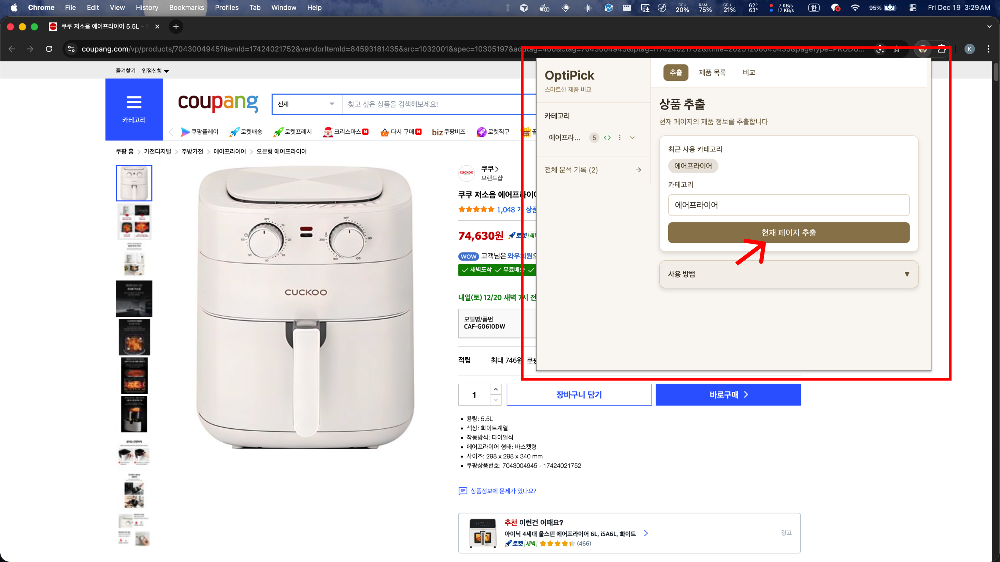
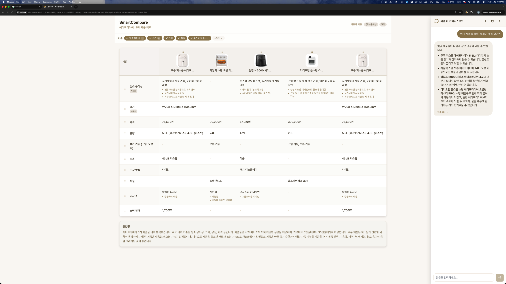
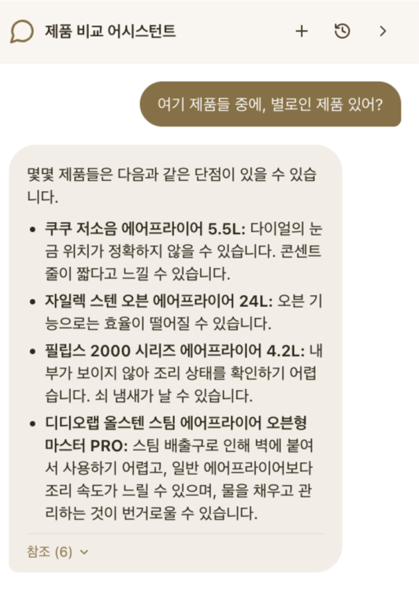
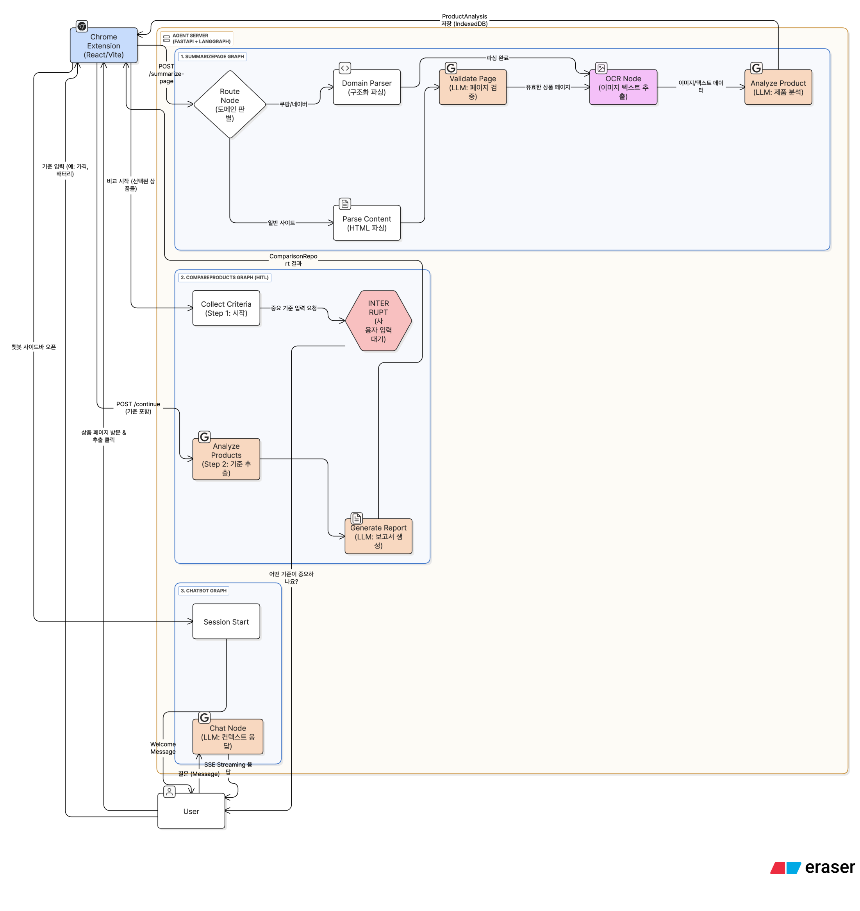

# OptiPick

AI 기반 개인화 상품 비교 Chrome Extension

LLM과 LangGraph를 활용하여 온라인 쇼핑몰의 상품 정보를 자동으로 추출하고, 사용자 기준에 따라 비교 분석하는 서비스입니다.

## 주요 기능

### 1. 상품 정보 자동 추출
- 쿠팡, 네이버 등 주요 쇼핑몰 전용 파서 지원
- OCR을 통한 이미지 내 스펙 정보 추출
- LLM 기반 상품 특징 및 장단점 자동 분석



### 2. 맞춤형 비교 분석
- Human-in-the-Loop(HITL) 패턴으로 사용자 비교 기준 반영
- 2~10개 상품 동시 비교
- 기준별 정리 및 종합 평가 제공



### 3. 대화형 AI 챗봇
- 비교 결과 기반 후속 질의응답
- SSE 스트리밍으로 실시간 응답
- 맥락을 유지하는 대화 히스토리 관리



## 시스템 아키텍처



```
┌─────────────────────────────────────────────────────────────┐
│                     Chrome Extension                         │
│  ┌──────────┐  ┌──────────┐  ┌──────────┐  ┌─────────────┐ │
│  │ Extract  │  │ Products │  │ Compare  │  │   Report    │ │
│  │   Page   │  │   Page   │  │   Page   │  │ + Chatbot   │ │
│  └──────────┘  └──────────┘  └──────────┘  └─────────────┘ │
│                        │                                     │
│              ┌─────────┴─────────┐                          │
│              │ Background Worker │                          │
│              └─────────┬─────────┘                          │
└────────────────────────┼────────────────────────────────────┘
                         │ HTTP API
┌────────────────────────┼────────────────────────────────────┐
│                  Agent (FastAPI)                             │
│  ┌─────────────────────┴─────────────────────┐              │
│  │            LangGraph Workflows             │              │
│  │  ┌───────────┐ ┌───────────┐ ┌─────────┐  │              │
│  │  │Summarize  │ │ Compare   │ │ Chatbot │  │              │
│  │  │Page Graph │ │Products   │ │  Graph  │  │              │
│  │  └───────────┘ │  Graph    │ └─────────┘  │              │
│  │                │  (HITL)   │              │              │
│  │                └───────────┘              │              │
│  └───────────────────────────────────────────┘              │
│           │                    │                             │
│    ┌──────┴──────┐      ┌──────┴──────┐                     │
│    │  LLM API    │      │  OCR API    │                     │
│    │  (Gemini)   │      │  (Clova)    │                     │
│    └─────────────┘      └─────────────┘                     │
└─────────────────────────────────────────────────────────────┘
```

## 기술 스택

| 구분 | 기술 |
|------|------|
| Extension | TypeScript, React, Vite, TailwindCSS |
| Storage | Chrome Extension API, IndexedDB (Dexie) |
| Agent | Python, FastAPI, LangGraph |
| AI/ML | Google Gemini 2.0 Flash, Clova OCR |
| 상태관리 | LangGraph MemorySaver |

## 설치 및 실행

### 사전 요구사항

- Node.js 18+
- Python 3.11+
- uv (Python 패키지 매니저)

### Agent 실행

```bash
cd agent

# 환경 변수 설정
cp .env.example .env
# .env 파일에 GEMINI_API_KEY, CLOVA_OCR_API_KEY 등 설정

# 의존성 설치 및 실행
uv sync
uv run uvicorn app.main:app --reload --port 8000
```

### Extension 빌드

```bash
cd extension

# 의존성 설치
npm install

# 개발 모드
npm run dev

# 프로덕션 빌드
npm run build
```

### Chrome Extension 설치

1. Chrome에서 `chrome://extensions` 접속
2. "개발자 모드" 활성화
3. "압축해제된 확장 프로그램을 로드합니다" 클릭
4. `extension/dist` 폴더 선택

## 프로젝트 구조

```
OptiPick/
├── extension/                 # Chrome Extension
│   ├── src/
│   │   ├── pages/            # Extension 페이지 컴포넌트
│   │   │   ├── ExtractPage/
│   │   │   ├── ProductsPage/
│   │   │   ├── ComparePage/
│   │   │   └── CompareReportPage/
│   │   ├── components/       # 공통 컴포넌트
│   │   ├── hooks/            # Custom React Hooks
│   │   ├── services/         # API 통신, 스토리지
│   │   ├── background/       # Background Worker
│   │   └── content/          # Content Script
│   └── manifest.json
│
├── agent/                     # LangGraph Agent
│   ├── app/
│   │   ├── graphs/           # LangGraph 워크플로우
│   │   │   ├── summarize_page.py
│   │   │   ├── compare_products.py
│   │   │   └── chatbot.py
│   │   ├── parsers/          # 도메인별 파서
│   │   │   ├── coupang.py
│   │   │   └── naver.py
│   │   ├── services/         # 외부 서비스 연동
│   │   │   ├── llm.py
│   │   │   └── ocr.py
│   │   └── main.py           # FastAPI 엔트리포인트
│   └── pyproject.toml
│
└── docs/                      # 문서 및 이미지
    └── images/
```

## 사용 방법

### 1. 상품 정보 추출

1. 쇼핑몰 상품 페이지 방문
2. OptiPick 아이콘 클릭
3. "추출" 버튼 클릭
4. 카테고리 지정 후 저장

### 2. 상품 비교

1. Products 페이지에서 비교할 상품 선택 (2~10개)
2. "비교하기" 버튼 클릭
3. 중요한 비교 기준 입력 (예: "가격, 성능, 무게")
4. 비교 결과 확인

### 3. 챗봇 질의

비교 결과 화면에서 우측 챗봇을 통해 추가 질문:
- "두 제품 중 가성비가 좋은 건?"
- "A 제품의 단점을 자세히 알려줘"
- "배터리 성능 기준으로 추천해줘"